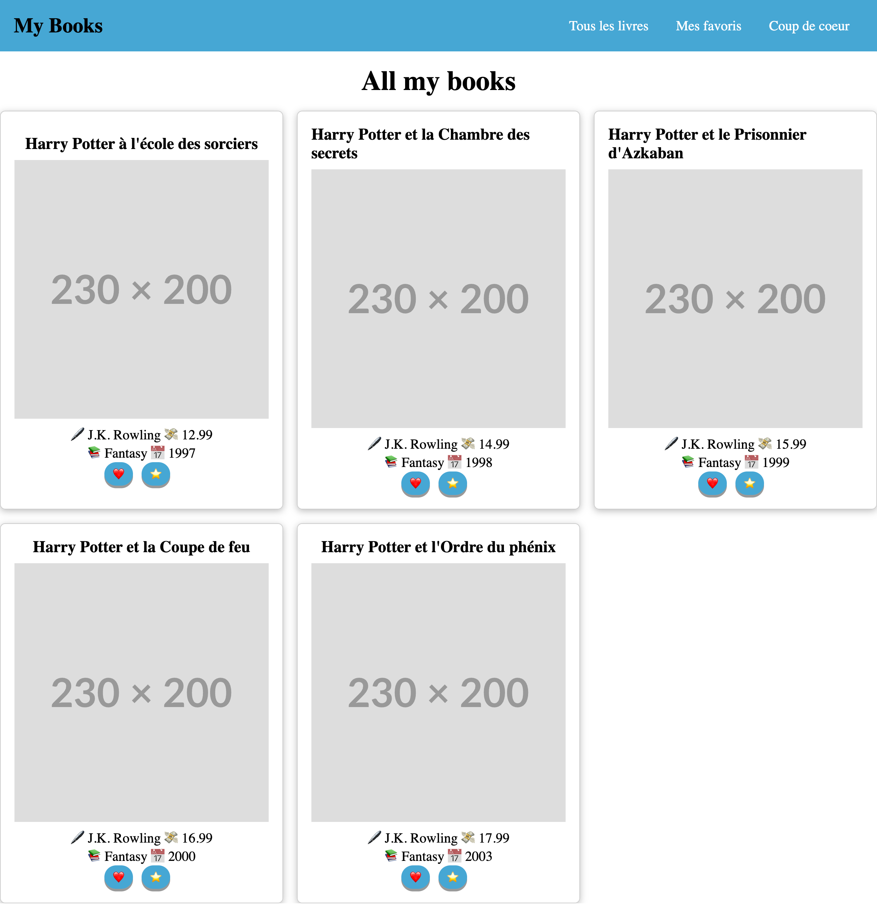

<h1 align="center">Welcome to Books 👋</h1>
<p>
  
  <a href="https://twitter.com/Gorski_anthony" target="_blank">
    
  </a>
</p>

> Nous allons apprendre le hook `useContext` dans un exemple concret

### 🏠 Homepage



### 🎯 Target

-   Apprendre :
    -   le hook `useContext`
    -   à créer un contexte
    -   à créer un provider
    -   à utiliser un contexte
    -   à utiliser un provider

Pour ce faire, nous allons changer le prix de nos livres en fonction de la devise choisie par l'utilisateur.

### 💸 Devise

```js
const currency = {
	EUR: {
		symbol: "€",
		rate: 1,
	},
	USD: {
		symbol: "$",
		rate: 1,08,
	},
	GBP: {
		symbol: "£",
		rate: 0.87,
	},
	JPY: {
		symbol: "¥",
		rate: 149.17,
	},
};
```

## Install

```sh
yarn install
# or
npm install
```

## Author

👤 **Anthony Gorski**

-   Twitter: [@Gorski_Anthony](https://twitter.com/Gorski_Anthony)
-   GitHub: [@GorskiAnthony](https://github.com/GorskiAnthony)

## Show your support

Give a ⭐️ if this project helped you!

---

👋 Qui suis-je ?
Je suis **Anthony Gorski**, développeur web et formateur à la [Wild Code School](https://www.wildcodeschool.com/fr-FR).
